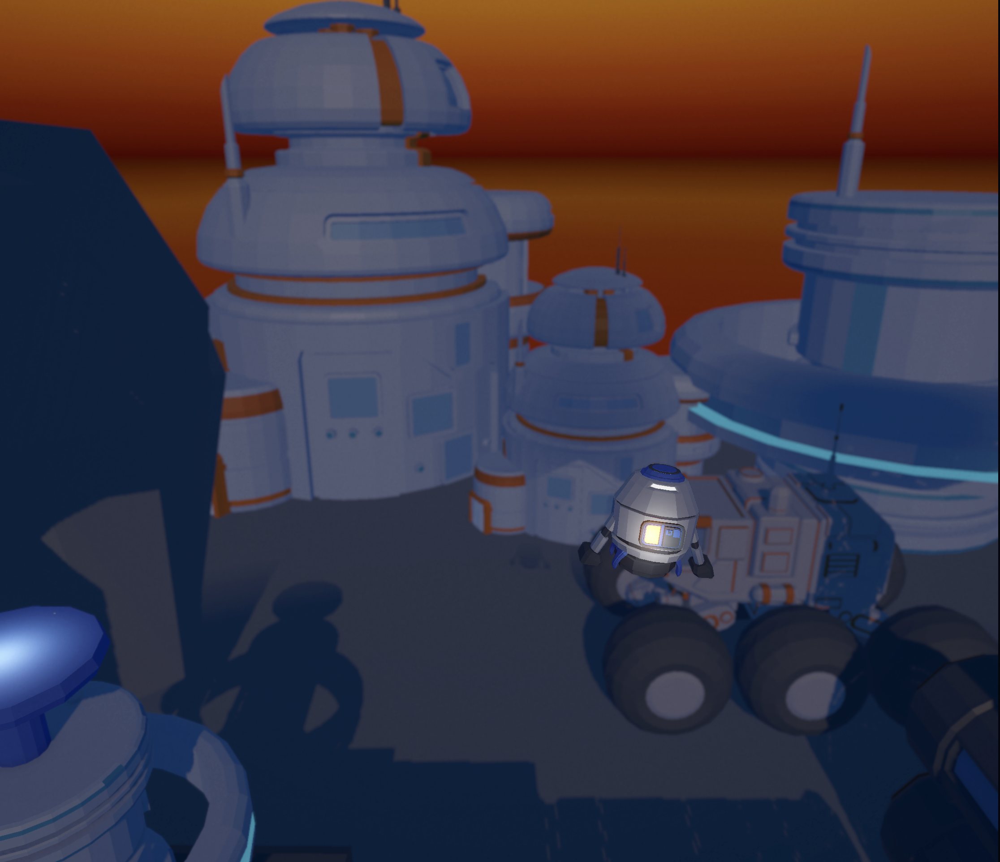

# 🚀 Rocket Boost

**Rocket Boost** is a simple yet thrilling physics-based 3D rocket game built using **Unity 6** and designed for web platforms. Your mission is to skillfully guide a rocket from the **launch pad** to the **landing pad** while avoiding obstacles and managing your thrust.

## 🎮 Gameplay

Control a rocket through a series of challenging levels. Each level requires precision, timing, and control over momentum.

- **Thrust (Spacebar)**: Ignite the rocket and gain upward thrust.
- **Left Arrow**: Rotate the rocket counter-clockwise.
- **Right Arrow**: Rotate the rocket clockwise.

Touch the landing pad to complete the level — but be careful! Crashing into obstacles or hitting the ground too hard will reset your progress.

---

## 🛠 Built With

- **Unity 6**
- **WebGL Build** for browser-based gameplay

---

## 🌐 Play Online

👉 [Play Rocket Boost](https://anuj0720.github.io/Rocket-Boost/)  

---

## 📽 Gameplay Demo

▶️ [Watch Gameplay Demo](Gameplay/gameplay.mp4)

---

## 🖼️ Screenshots

  
  

---

